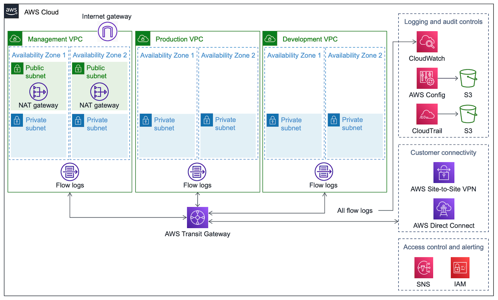

Deploying this Quick Start with default parameters builds the following {partner-product-short-name} environment in the AWS Cloud.

:xrefstyle: short
[#architecture1]
.Quick Start architecture for {partner-product-short-name} on AWS

As shown in <<architecture1>>, the Quick Start sets up the following:

* A highly available architecture that spans two Availability Zones.
* Three virtual private clouds (VPCs) configured with subnets, according to AWS best practices, to provide you with your own virtual network on AWS. The management VPC _ _ _ _ [briefly describe the function]. The production VPC _ _ _ _ [briefly describe the function]. The development VPC _ _ _ _ [briefly describe the function].
* In the management VPC:
** An internet gateway, which serves as a highly available https://docs.aws.amazon.com/whitepapers/latest/building-scalable-secure-multi-vpc-network-infrastructure/centralized-egress-to-internet.html[centralized point of egress for internet traffic^].
** Public subnets that include managed network address translation (NAT) gateways to allow outbound internet access for resources in the private subnets.
** Private subnets for _ _ _ _ . 
** Flow logs for _ _ _ _ .
* In the production VPC:
** Private subnets for _ _ _ _ . 
** Flow logs for _ _ _ _ .
* In the development VPC:
** Private subnets for _ _ _ _ . 
** Flow logs for _ _ _ _ .
* AWS Transit Gateway for VPC-to-VPC communication and customer connectivity.
* For logging and audit controls:
** Amazon CloudWatch for metric monitoring and threshold alarms. This service delivers flow logs to an S3 bucket.
** AWS Config with the conformance pack for HIPAA, maps HIPAA controls to AWS configuration items. This service delivers flow logs to an S3 bucket.
** AWS CloudTrail for AWS access logging. This service delivers flow logs to an S3 bucket.
* For customer connectivity:
** AWS Site-to-Site VPN or AWS Direct Connect to connect with AWS Transit Gateway.
* For access control and alerting:
** Amazon Simple Notification Service (Amazon SNS) for sending email alerts from alarms.
** AWS Identity and Access Management (IAM) for _ _ _ _ .

//TODO Andrew, In the diagram, are the flow logs supposed to be outside the subnets and AZs?
//TODO Andrew, In the diagram, are all the other elements accurately placed, arrows correct, etc.? (I've edited for clarity and flow.) 
//TODO Andrew, In the bulleted list, please fill in the blanks re: each VPC's function.
//TODO Andrew, In the bulleted list, please fill in the blanks re: the private subnets.
//TODO Andrew, In the bulleted list, please fill in the blanks re: the flow logs.
//TODO Andrew, In the bulleted list, please fill in the blank re: IAM.