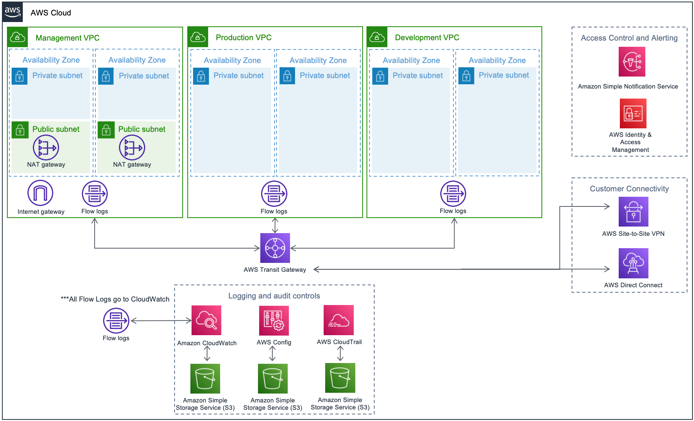

AWS compliance solutions help streamline, automate, and implement secure baselines in AWS—from initial design to operational security readiness. They incorporate the expertise of AWS solutions architects, security, and compliance personnel to help you build a secure and reliable architecture easily through automation. +

This Quick Start includes AWS CloudFormation templates, which can be integrated with AWS Service Catalog, to automate building a baseline architecture that fits within your organization's larger HIPAA compliance program. It also includes a security controls reference, which maps HIPAA regulatory requirements to architecture decisions, features, and configuration of the baseline. 

// Deploying this Quick Start for a new virtual private cloud (VPC) with
// default parameters builds the following {partner-product-short-name} environment in the
// AWS Cloud.

// Replace this example diagram with your own. Send us your source PowerPoint file. Be sure to follow our guidelines here : http://(we should include these points on our contributors giude)
:xrefstyle: short
[#architecture1]
.Quick Start architecture for {partner-product-short-name} on AWS

As shown in <<architecture1>>, the Quick Start sets up the following:

* A highly available architecture with three Virtual Private Clouds (VPCs) with subnets spanning two Availability Zones, according to AWS best practices, to provide you with your own virtual network on AWS.
* A highly available centralized point of egress for Internet traffic.
* A Transit Gateway for VPC to VPC communication and connection point for customer connectivity (Site to Site VPN or Direct Connect).
* AWS CloudTrail for AWS access logging with logs delivered to a secure Simple Storage Service (S3) Bucket.
* AWS CloudWatch for metric monitoring and threshold alarms with logs delivered to a secure Simple Storage Service (S3) Bucket.
* AWS Config with the Conformance Pack for HIPAA that maps HIPAA controls to AWS configuration items.
* Amazon Simple Notification Service Topic for sending email alerts from alarms.

*AWS Services* +
https://docs.aws.amazon.com/awscloudtrail/latest/userguide/cloudtrail-user-guide.html[AWS CloudTrail] – AWS CloudTrail records AWS API calls and delivers log files that include caller identity, time, source IP address, request parameters, and response elements. The call history and details provided by CloudTrail enable security analysis, resource change tracking, and compliance auditing. +
https://docs.aws.amazon.com/AmazonCloudWatch/latest/monitoring/WhatIsCloudWatch.html[Amazon CloudWatch] – Amazon CloudWatch is a monitoring service for AWS Cloud resources and the applications you run on AWS. You can use CloudWatch to collect and track metrics, collect and monitor log files, set alarms, and automatically react to changes in your AWS resources. +
https://docs.aws.amazon.com/config/latest/developerguide/[AWS Config] – AWS Config is a fully managed service that provides you with an AWS resource inventory, configuration history, and configuration change notifications to enable security and governance. AWS Config rules enable you to automatically check the configuration of AWS resources recorded by AWS Config. +
https://docs.aws.amazon.com/glacier/[Amazon S3 Glacier] – Amazon S3 Glacier is a storage service for archiving and long-term backup of infrequently used data. It provides secure, durable, and extremely low-cost storage, supports data transfer over SSL, and automatically encrypts data at rest. With S3 Glacier, you can store your data for months, years, or even decades at a very low cost. +
https://aws.amazon.com/documentation/vpc/[Amazon VPC] – The Amazon Virtual Private Cloud (Amazon VPC) service lets you provision a private, logically isolated section of the AWS Cloud where you can launch AWS services and other resources in a virtual network that you define. You have complete control over your virtual networking environment, including selection of your own IP address range, creation of subnets, and configuration of route tables and network gateways. +

*HIPAA Eligible Services* +
You must process, store, and transmit protected health information (PHI) using only HIPAA Eligible Services, as defined in the AWS BAA. The most current list of HIPAA Eligible Services can be found at https://aws.amazon.com/compliance/hipaa-eligible-services-reference/. You may use the full range of AWS services with non-PHI data, even in a HIPAA Account under the AWS BAA.
