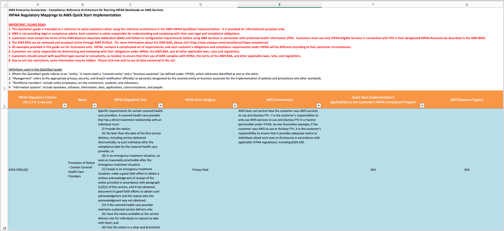

// Replace the content in <>
// Briefly describe the software. Use consistent and clear branding.
// Include the benefits of using the software on AWS, and provide details on usage scenarios.

:xrefstyle: short

The {partner-product-name} Quick Start helps automate building a baseline architecture that fits within your organization's larger HIPAA-compliance program. Like other AWS compliance architectures, it helps streamline, automate, and implement secure baselines in AWS—from initial design to operational security readiness. It incorporates the expertise of AWS solutions architects, security, and compliance personnel to help you build a secure and reliable architecture through automation.

This Quick Start includes AWS CloudFormation templates, which can be integrated with AWS Service Catalog, to automate building a baseline architecture that fits within your organization's larger HIPAA-compliance program. It also includes a https://fwd.aws/7M7b9?[downloadable security controls matrix^] (Microsoft Excel spreadsheet), which maps HIPAA regulatory requirements to AWS Quick Start implementation. <<matrix-excerpt>> provides an excerpt of the information in that spreadsheet.

[#matrix-excerpt]
.Security controls matrix (excerpt)
[link=images/security-controls-matrix-excerpt.png]

You must process, store, and transmit protected health information (PHI) using only HIPAA-eligible AWS services, as defined in the AWS BAA. You may use the full range of AWS services with non-PHI data, even in a HIPAA account under the AWS BAA. For the current list of HIPAA-eligible services, see https://aws.amazon.com/compliance/hipaa-eligible-services-reference/[HIPAA Eligible Services Reference^]. 